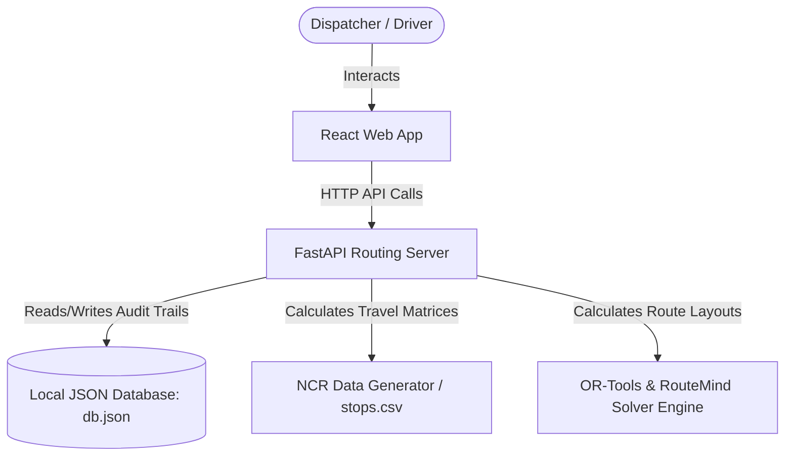
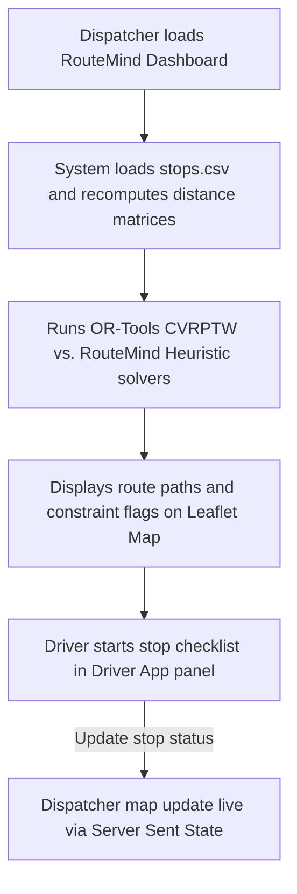
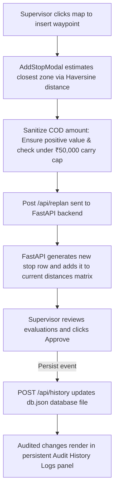
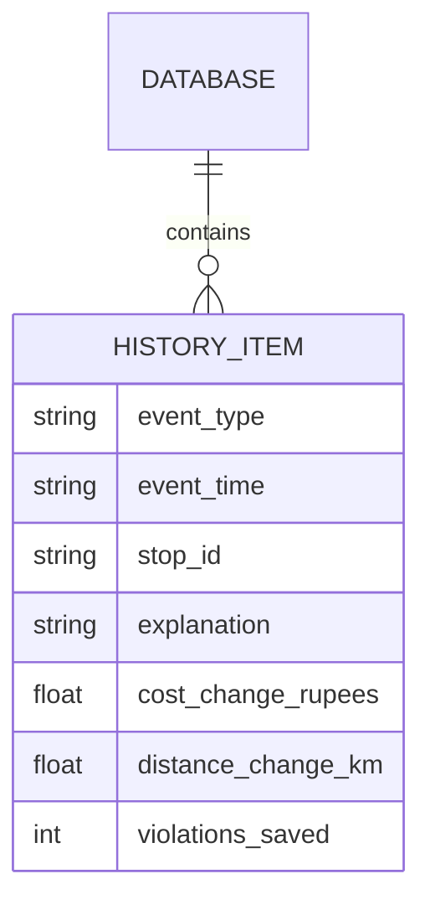
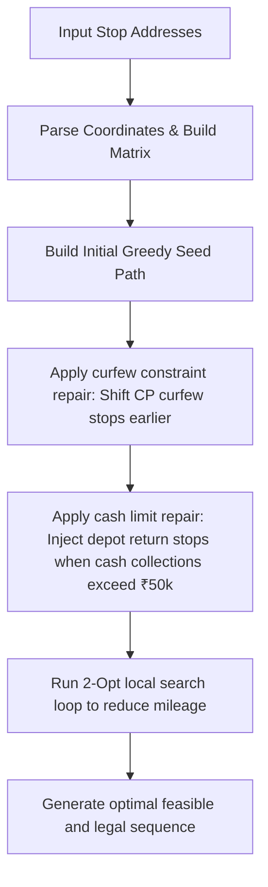

# RouteMind - Smart Last-Mile Route Planner with Constraint Repair

RouteMind is an intelligent logistics planning and real-time route optimization engine. It couples classical combinatorial optimization solvers (Google OR-Tools) with a rule-based AI constraint-repair heuristic specifically designed to model and bypass real-world Indian policy, safety, and payment limits. It features an interactive dispatcher dashboard, a simulated driver companion terminal with local storage fail-safe caching, and a persistent audit database.

---


---

## 📊 Stage 1 vs. Stage 2 Comparison

| Feature / Metric | Stage 1 (Initial Prototype) | Stage 2 (Hackathon-Level Upgrades) |
| :--- | :--- | :--- |
| **Codebase Architecture** | Monolithic `App.jsx` (1,300+ lines), high coupling, low readability. | **Modular Component Architecture** (7 distinct subcomponents in `src/components/`). |
| **Dataset Source** | Hardcoded generated Delhi NCR stops only. | **Static CSV Dataset Integration** (`stops.csv`) with automatic haversine distance matrix parsing. |
| **Supervisor Logs & Audit** | Ephemeral, in-memory logs; lost on browser reload. | **Persistent JSON Local Database** (`db.json`) recording approved delta evaluations and metrics. |
| **Map Custom Stop Inputs** | Basic numeric prompt; no zone selections; defaults to Z3. | **Smart Input Validation** (negative checks, ₹50,000 cash caps) & **Haversine closest-zone suggestions**. |
| **UI UX Responsiveness** | Fixed desktop layout; maps and panels clip on small screen sizes. | **Fluid CSS Flex & Container stack queries** enabling desktop, tablet, and mobile responsiveness. |
| **Loading & Error UX** | Basic inline text; no overlay block during routing calculations. | **Glassmorphic Loader Screens** with pulsing glows indicating computation state. |
| **Robust Error Handling** | Network failures or key mismatches result in silent internal server errors (500). | **Input Sanitization, Matrix Key Synchronizations**, and custom HTTP 400 error codes. |

---

## 🛠️ Technology Stack
*   **Frontend**: React (Vite), Vanilla CSS (Glassmorphism design tokens), Leaflet.js (Map renderings)
*   **Backend**: FastAPI (Python 3.11+), Uvicorn ASGI Server
*   **Database**: Persistent File-based JSON Database (`backend/db.json`)
*   **Routing Algorithms**: Google OR-Tools (Classical CVRPTW Solver), Local Heuristics (2-Opt TSP search, Constraint-Repair heuristic)
*   **APIs**: REST API (JSON payload data schemas)

---

## 🧩 System Architecture



---

## 🔄 User / Application Workflow



---

## 🔄 Stage 2 Improvement Workflow



---

## 📁 Database Entity Relationship (ER) Diagram



---

## 🧠 AI / ML Heuristics Solver Pipeline



---

## 📂 Project Structure

```
new/
├── backend/
│   ├── db.json            # Persistent JSON database (Stage 2)
│   ├── stops.csv          # Loaded stops dataset file (Stage 2)
│   ├── data_generator.py  # Delhi NCR test data matrix parser
│   ├── solvers.py         # OR-Tools & RouteMind solvers
│   ├── main.py            # FastAPI main router endpoints
│   ├── test_solvers.py    # Unit tests
│   └── requirements.txt   # Python dependencies
├── src/
│   ├── components/        # Modular Subcomponents directory (Stage 2)
│   │   ├── Header.jsx
│   │   ├── KpiSummary.jsx
│   │   ├── RouteMap.jsx
│   │   ├── DriverAppSimulator.jsx
│   │   ├── SupervisorDrawer.jsx
│   │   ├── ResetModal.jsx
│   │   └── AddStopModal.jsx
│   ├── App.css            # Responsive layout & Glassmorphic overlays
│   ├── App.jsx            # State coordinator & API integrations
│   └── main.jsx           # Main mount file
├── package.json           # Node configuration
├── vite.config.js         # Proxy configuration
└── README.md              # Documentation
```

---

## 🔌 API Documentation

### 1. `GET /api/route-data`
*   **Description**: Returns active routing problem data.
*   **Parameters**: `stops` (optional int) - number of stops to return.
*   **Return Schema**: JSON object containing depot, stops dictionaries, and travel matrices.

### 2. `POST /api/solve`
*   **Description**: Solve the active dataset using a specific solver.
*   **Payload**: `{"solver_type": "naive"|"ortools"|"routemind", "problem_data": {...}}`
*   **Return Schema**: Computed route cost, sequence, stops ETA lists, and violations counts.

### 3. `POST /api/replan`
*   **Description**: Insert a dynamic stop or bypass a failed stop, returning the re-evaluated route.
*   **Payload**: `{"current_sequence": [...], "event_type": "NEW_PICKUP"|"FAILED_DELIVERY", "event_data": {...}, "problem_data": {...}}`
*   **Return Schema**: Re-planned evaluation route, natural language explanation, and cost delta.

### 4. `GET /api/history`
*   **Description**: Retrieve all persistent audit history records.
*   **Return Schema**: Array of HistoryItem objects.

### 5. `POST /api/history`
*   **Description**: Insert a new audit log record.
*   **Payload**: JSON schema mapping to `HistoryItem`.

### 6. `POST /api/history/clear`
*   **Description**: Wipe all database records from `db.json`.

---

## ⚙️ Installation & Setup

### Prerequisites
*   Node.js 18+ & npm
*   Python 3.11+ & pip

### Step 1: Clone and install backend dependencies
```bash
pip install -r backend/requirements.txt
```

### Step 2: Start the FastAPI API Server
```bash
python -X utf8 backend/main.py
```
*API will listen at `http://127.0.0.1:5000`.*

### Step 3: Open a new shell and start the React dev server
```bash
npm install
npm run dev
```
*Frontend will serve at `http://localhost:3000`.*

---

